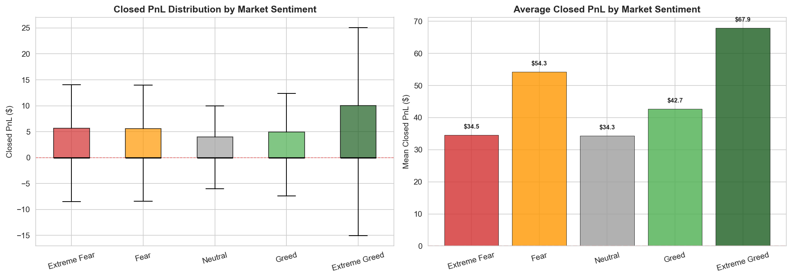
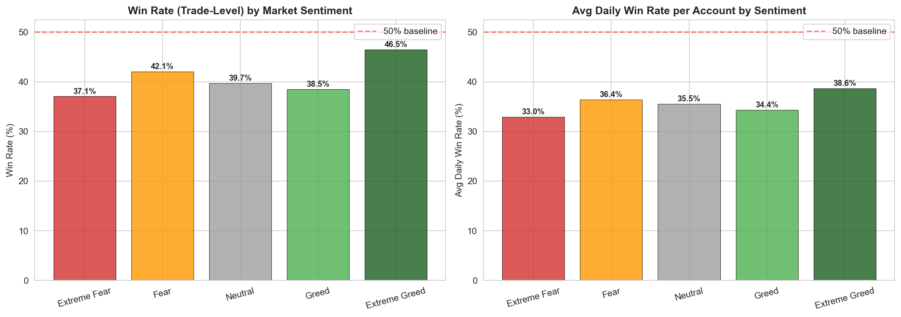
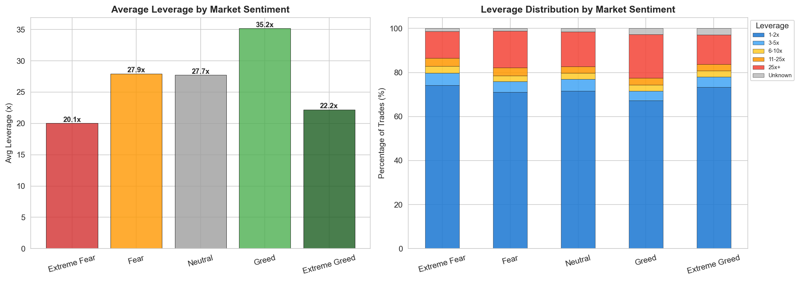
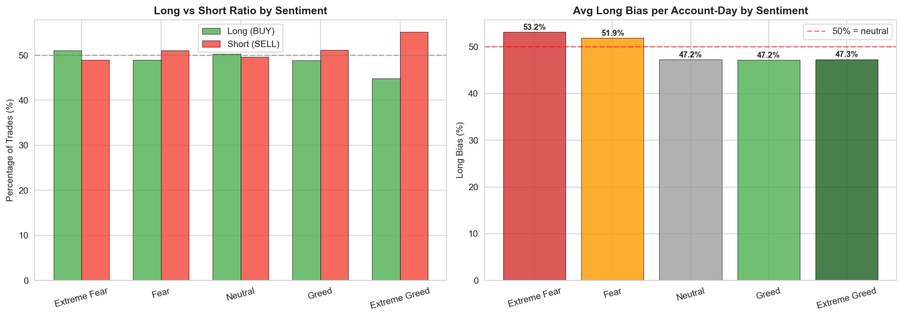
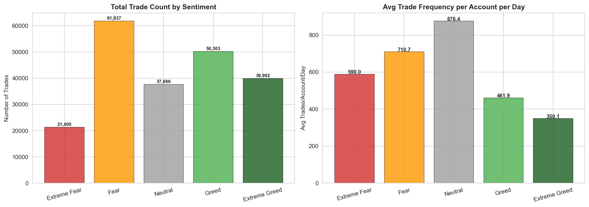
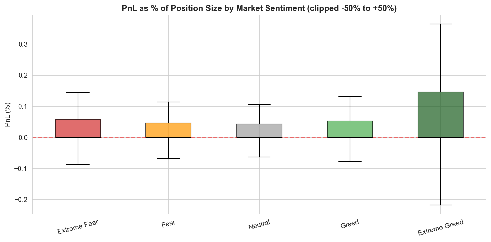
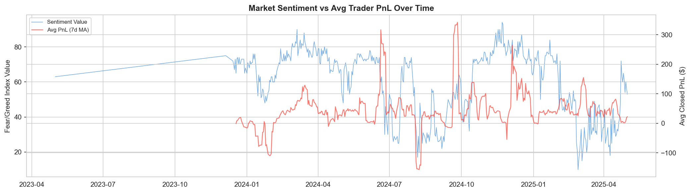
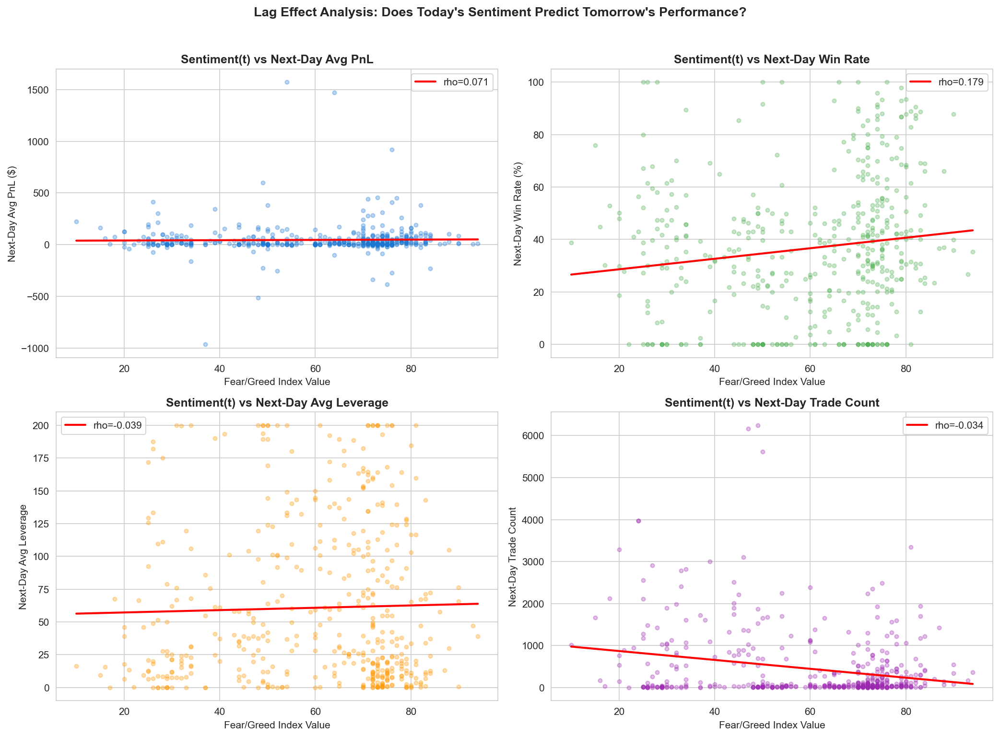
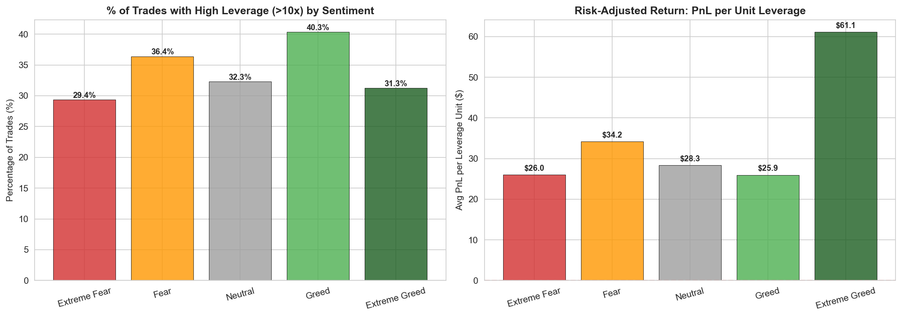
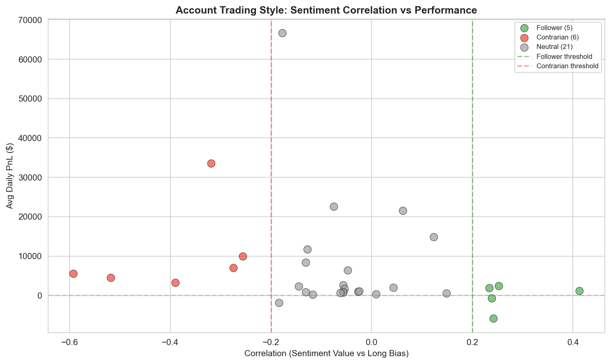

# Sentiment-Driven Trading on Hyperliquid

Analysis of how Bitcoin Fear/Greed sentiment cycles impact leverage usage, win rates, and PnL across 211,218 perpetual futures trades on Hyperliquid.

## Overview

| Metric | Value |
|--------|-------|
| Total Trades | 211,218 |
| Unique Accounts | 32 |
| Date Range | May 2023 - May 2025 |
| Match Rate | 100% |

## Key Findings

- **Extreme Greed** yields the highest win rate (46.5%) and best risk-adjusted returns ($61.1/leverage unit)
- **Greed** shows the highest leverage usage (40.3% >10x) but worst risk-adjusted returns
- **Contrarian traders** earn 3x more during Fear periods ($159 vs $53 avg PnL)
- **Sentiment-following accounts** lose money (-$205/day) while contrarians profit (+$10,658/day)
- Today's sentiment **significantly predicts** tomorrow's win rate (rho=0.179, p<0.001)

All statistical tests (Kruskal-Wallis, Chi-Square, Mann-Whitney U) confirm significance at p < 10^-50.

## Charts

| Chart | Description |
|-------|-------------|
|  | PnL Distribution by Sentiment |
|  | Win Rate by Sentiment |
|  | Leverage by Sentiment |
|  | Long/Short Bias by Sentiment |
|  | Trade Volume & Frequency |
|  | PnL% by Sentiment |
|  | Sentiment vs PnL Timeline |
|  | Lag Effects Analysis |
|  | Leverage & Risk Behavior |
|  | Account Trading Styles |

## Strategy Recommendations

1. **Long during Extreme Fear** (Index <25) with 3-5x leverage
2. **Reduce leverage to 1-2x during Greed** (Index >60)
3. **Moderate leverage longs during Extreme Greed** (Index >75)
4. **Exploit lag effects** - position for continuation on high-sentiment days
5. **Trade sentiment transitions** between categories
6. **Avoid high leverage during Fear** - volatility makes it dangerous

## Project Structure

```
├── FINAL_REPORT.md                 # Full analysis report
├── analysis_step1_clean_merge.py   # Data cleaning & merging
├── analysis_step2_features_charts.py # Feature engineering & visualizations
├── analysis_step3_statistics.py    # Statistical tests
├── analysis_step4_patterns.py      # Pattern identification
├── chart1-10 *.png                 # Visualization charts
└── .gitignore
```

## Requirements

```bash
pip install pandas numpy matplotlib seaborn scipy
```

## License

MIT
